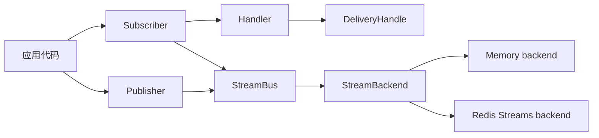
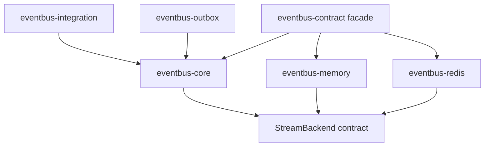

# OINK Documentation Site Implementation Plan

> **For agentic workers:** REQUIRED SUB-SKILL: Use superpowers:subagent-driven-development (recommended) or superpowers:executing-plans to implement this plan task-by-task. Steps use checkbox (`- [ ]`) syntax for tracking.

**Goal:** Add a Chinese-first OINK documentation site under `website/` and deploy its warning-strict static build to GitHub Pages.

**Architecture:** Keep the Rust workspace unchanged and treat `website/` as an independent Hugo Module pinned to OINK v1.0.0. Author task-oriented Markdown from current public APIs, runnable examples, and tests; validate the generated static contract with a repository-owned shell checker before a dedicated GitHub Actions workflow uploads `website/public/` to Pages.

**Tech Stack:** OINK v1.0.0, Hugo Extended 0.165.0, Go 1.27, Markdown, Mermaid, Bash, GitHub Actions, GitHub Pages.

**Spec:** `docs/superpowers/specs/2026-08-31-oink-documentation-site-design.md`

## Global Constraints

- Do not modify Rust source files, public API symbols, Cargo manifests, or existing Rust CI behavior.
- Keep the initial site Simplified-Chinese-only; use unsuffixed `.md` source files.
- Pin `github.com/pgsty/oink v1.0.0`, Go `1.27.0`, and Hugo Extended `0.165.0`.
- Use `https://mapseekai.github.io/eventbus-contract/` as the checked production URL and let Pages override it at deployment time.
- Set `github_repo` to `https://github.com/mapseekai/eventbus-contract`, `github_branch` to `main`, and `github_subdir` to `website`.
- Keep Blog, Book, comments, analytics, remote search, English, and French out of scope.
- Keep exact API signatures authoritative on docs.rs; project pages explain concepts, tasks, examples, and constraints.
- Derive tutorial code from current repository examples and behavior verified by tests.
- Run shell commands through `rtk` locally; commands committed into GitHub Actions or end-user documentation remain portable commands without `rtk`.
- Preserve all pre-existing user changes. Do not edit the dirty root `.gitignore`; use `website/.gitignore`.
- Never commit `website/public/`, `website/resources/`, `website/.hugo_cache/`, or `website/.hugo_build.lock`.
- Whenever a task adds verifier assertions, insert them immediately before the final success `printf` in `website/scripts/verify-site.sh`.
- Give section pages weights 10, 20, 30, 40, and 50 in the approved order; give child pages weights in increments of 10 in their listed order.

---

## File Structure

### Site foundation

- Create `website/.gitignore`: ignore generated Hugo state.
- Create `website/go.mod` and generated `website/go.sum`: pin OINK and Go.
- Create `website/hugo.yaml`: configure language, outputs, repository links, and the OINK module.
- Create `website/README.md`: document preview, strict build, and upgrades.
- Create `website/assets/icons/logo.svg` and `website/static/favicon.svg`: local identity.
- Create `website/data/home/zh.yaml`: landing page.
- Create `website/content/_index.md` and `website/content/docs/_index.md`: content roots.
- Create `website/scripts/verify-site.sh`: generated-site contract.

### Reader documentation

- Create `website/content/docs/start/`: overview, installation/features, quickstart.
- Create `website/content/docs/guides/`: memory, Redis, Watermill, competing consumers.
- Create `website/content/docs/concepts/`: envelope, contracts, delivery, guarantees/idempotency, ordering/backpressure.
- Create `website/content/docs/reference/`: crates/features, configuration, errors, examples/commands.
- Create `website/content/docs/contributing/`: architecture, backend implementation, testing, releases.

### Repository integration

- Create `.github/workflows/docs.yml`: PR checks and Pages deployment.
- Modify `README.md:5`: add the published documentation entry point.
- Modify `docs/superpowers/specs/2026-08-31-oink-documentation-site-design.md`: use `website/.gitignore`.

---

### Task 1: Scaffold the Deterministic OINK Site

**Files:**
- Create: `website/.gitignore`
- Create: `website/go.mod`
- Create: `website/go.sum`
- Create: `website/hugo.yaml`
- Create: `website/README.md`
- Create: `website/assets/icons/logo.svg`
- Create: `website/static/favicon.svg`
- Create: `website/data/home/zh.yaml`
- Create: `website/content/_index.md`
- Create: `website/content/docs/_index.md`
- Create: `website/scripts/verify-site.sh`

**Interfaces:**
- Consumes: OINK module `github.com/pgsty/oink v1.0.0`.
- Produces: `website/scripts/verify-site.sh [site-root]`, returning 0 only when source and generated baseline artifacts exist.
- Produces: a single-language site rooted at the configured GitHub Pages project path.

- [ ] **Step 1: Write the failing baseline verifier**

Create executable `website/scripts/verify-site.sh`:

```bash
#!/usr/bin/env bash
set -euo pipefail

script_dir="$(cd "$(dirname "${BASH_SOURCE[0]}")" && pwd)"
site_dir="${1:-$(cd "${script_dir}/.." && pwd)}"
public_dir="${site_dir}/public"

fail() {
  printf 'verify-site: %s\n' "$*" >&2
  exit 1
}

require_file() {
  [[ -f "$1" ]] || fail "missing file: $1"
}

require_text() {
  local file="$1"
  local text="$2"
  require_file "${file}"
  grep -Fq -- "${text}" "${file}" || fail "missing text '${text}' in ${file}"
}

require_glob() {
  compgen -G "$1" >/dev/null || fail "missing generated file matching: $1"
}

require_file "${site_dir}/hugo.yaml"
require_file "${site_dir}/go.mod"
require_file "${site_dir}/go.sum"
require_file "${site_dir}/content/_index.md"
require_file "${site_dir}/content/docs/_index.md"
require_file "${public_dir}/index.html"
require_file "${public_dir}/index.md"
require_file "${public_dir}/index.xml"
require_file "${public_dir}/llms.txt"
require_file "${public_dir}/sitemap.xml"
require_file "${public_dir}/robots.txt"
require_file "${public_dir}/404.html"
require_file "${public_dir}/docs/index.xml"
require_file "${public_dir}/_print/docs/index.html"
require_glob "${public_dir}/offline-search-index.*.json"
require_text "${public_dir}/index.html" "eventbus-contract"
require_text "${public_dir}/index.html" "/eventbus-contract/"
require_text "${public_dir}/index.html" "https://mapseekai.github.io/eventbus-contract/"
require_text "${public_dir}/index.html" "offline-search-index"
require_text "${public_dir}/llms.txt" "文档"
require_text "${public_dir}/robots.txt" "Allow: /"
require_text "${public_dir}/robots.txt" "Sitemap:"

printf 'verify-site: baseline contract passed\n'
```

- [ ] **Step 2: Run the verifier to prove RED**

```bash
rtk bash website/scripts/verify-site.sh
```

Expected: FAIL with `missing file: .../website/hugo.yaml`.

- [ ] **Step 3: Add pinned module, local ignores, and site configuration**

Create `website/go.mod`:

```go
module github.com/mapseekai/eventbus-contract/website

go 1.27.0

require github.com/pgsty/oink v1.0.0
```

Create `website/.gitignore`:

```gitignore
/public/
/resources/
/.hugo_build.lock
/.hugo_cache/
```

Create `website/hugo.yaml`:

```yaml
title: &siteTitle eventbus-contract
baseURL: https://mapseekai.github.io/eventbus-contract/
defaultContentLanguage: zh
enableGitInfo: true
enableRobotsTXT: true
enableEmoji: true
timeZone: Asia/Shanghai

languages:
  zh:
    label: 简体中文
    locale: zh-CN
    weight: 1
    title: *siteTitle
    hasCJKLanguage: true
    params:
      description: Rust 对象安全事件总线契约、内存后端与 Redis Streams 后端。

markup:
  goldmark:
    renderer:
      unsafe: true
    parser:
      attribute:
        block: true
      wrapStandAloneImageWithinParagraph: false
  highlight:
    noClasses: false

outputs:
  home: [HTML, RSS, markdown, LLMS]
  page: [HTML, markdown]
  section: [HTML, RSS, print, markdown]

params:
  offline_search: true
  github_repo: https://github.com/mapseekai/eventbus-contract
  github_branch: main
  github_subdir: website
  logo: icons/logo.svg
  copyright:
    authors: eventbus-contract contributors
    from_year: 2026
  footer_center_info: ''
  ui:
    dark_mode: true
    section_index: cards
    sidebar_menu_foldable: true
    sidebar_icon_policy: groups
    backlinks: true

module:
  imports:
    - path: github.com/pgsty/oink
  hugoVersion:
    extended: true
    min: 0.160.1
```

- [ ] **Step 4: Add baseline content roots**

Create `website/content/_index.md`:

```markdown
---
title: eventbus-contract
description: Rust 对象安全事件总线契约、内存后端与 Redis Streams 后端。
---
```

Create `website/content/docs/_index.md`:

```markdown
---
title: 文档
linkTitle: 文档
description: 从安装和快速开始，到投递语义、后端选择与贡献指南。
type: docs
icon: fa-solid fa-book
sidebar_root_for: self
sidebar_root_link_self: true
menus:
  main:
    identifier: docs
    weight: 10
cascade:
  type: docs
  footer_style: slim
---

从快速开始进入项目，再按任务查阅后端指南、核心概念、参考资料和贡献者说明。
```

Create `website/data/home/zh.yaml`:

```yaml
sections: [hero, cards, cta]

hero:
  align: center
  eyebrow: Rust 事件驱动基础设施
  title_lines:
    - words: [{ text: 一套契约， }]
    - words: [{ text: 多种消息后端。 }]
  lead: eventbus-contract 为发布、订阅、投递确认、重试和死信定义对象安全的 Rust API。
  actions:
    - { label: 阅读文档, url: docs/, icon: fa-solid fa-book, style: primary }
    - { label: 查看源码, url: https://github.com/mapseekai/eventbus-contract, icon: fa-brands fa-github, style: ghost }

cards:
  eyebrow: 稳定、可测试、可替换
  title: 从清晰边界开始
  columns: 3
  items:
    - title: 对象安全契约
      desc: Publisher、Subscriber、Handler 与 DeliveryHandle 可作为依赖注入边界。
      icon: fa-solid fa-code
      url: docs/
    - title: 可替换后端
      desc: 开发测试使用内存后端，生产环境接入 Redis Streams。
      icon: fa-solid fa-shuffle
      url: docs/
    - title: 明确投递语义
      desc: 组合 ACK、重试、DLQ、顺序、背压与幂等策略。
      icon: fa-solid fa-shield-halved
      url: docs/

cta:
  title: 先用内存后端跑通第一条消息。
  text: 默认 feature 无需外部服务，适合验证发布、订阅和确认流程。
  label: 进入文档
  url: docs/
  style: primary
```

- [ ] **Step 5: Add local assets and operating instructions**

Create `website/assets/icons/logo.svg` and `website/static/favicon.svg` with:

```svg
<svg xmlns="http://www.w3.org/2000/svg" viewBox="0 0 64 64" role="img" aria-label="eventbus-contract">
  <rect width="64" height="64" rx="14" fill="#17385c"/>
  <path d="M16 20h32v8H16zm0 16h32v8H16z" fill="#f4b942"/>
  <circle cx="20" cy="24" r="3" fill="#fff"/>
  <circle cx="44" cy="40" r="3" fill="#fff"/>
  <path d="M20 27v10m24-10v10" stroke="#fff" stroke-width="3" stroke-linecap="round"/>
</svg>
```

Create `website/README.md`:

````markdown
# eventbus-contract documentation site

This directory contains the Chinese OINK documentation site published at
<https://mapseekai.github.io/eventbus-contract/>.

## Requirements

- Git
- Go 1.27 or newer
- Hugo Extended 0.165.0

Confirm that `hugo version` contains `extended`.

## Preview

```bash
cd website
hugo server
```

Open <http://localhost:1313/>.

## Production build

```bash
cd website
hugo --cleanDestinationDir --gc --minify --environment production \
  --printPathWarnings --panicOnWarning
bash scripts/verify-site.sh
```

## Theme upgrades

Keep OINK and Hugo upgrades in a dedicated change. Update OINK in `go.mod`,
refresh `go.sum` with `go mod download github.com/pgsty/oink`, run the strict
build, and inspect the home page, quickstart, diagrams, search, Markdown output,
and `llms.txt` before merging.
````

- [ ] **Step 6: Resolve OINK and prove GREEN**

```bash
cd website
rtk go mod download github.com/pgsty/oink
rtk hugo --cleanDestinationDir --gc --minify --environment production \
  --printPathWarnings --panicOnWarning
cd ..
rtk bash website/scripts/verify-site.sh
```

Expected: `go.sum` is created, Hugo has no warning, and verifier prints `baseline contract passed`.

- [ ] **Step 7: Commit foundation**

```bash
rtk git add website
rtk git commit -m "docs: scaffold OINK documentation site"
```

---

### Task 2: Author the Start Path

**Files:**
- Modify: `website/data/home/zh.yaml`
- Modify: `website/scripts/verify-site.sh`
- Create: `website/content/docs/start/_index.md`
- Create: `website/content/docs/start/overview.md`
- Create: `website/content/docs/start/installation.md`
- Create: `website/content/docs/start/quickstart.md`

**Interfaces:**
- Consumes: baseline Docs root and the `MemoryStreamBackend` example flow.
- Produces: `/docs/start/` onboarding with a copyable quickstart.

- [ ] **Step 1: Add failing onboarding checks**

Insert before the verifier success message:

```bash
require_file "${public_dir}/docs/start/index.html"
require_file "${public_dir}/docs/start/overview/index.html"
require_file "${public_dir}/docs/start/installation/index.html"
require_file "${public_dir}/docs/start/quickstart/index.html"
require_file "${public_dir}/docs/start/quickstart/index.md"
require_text "${public_dir}/docs/start/installation/index.md" "redis-watermill"
require_text "${public_dir}/docs/start/quickstart/index.md" "AckMode::Manual"
require_text "${public_dir}/docs/start/quickstart/index.md" "先订阅，再发布"
require_text "${public_dir}/llms.txt" "五分钟快速开始"
```

- [ ] **Step 2: Build and prove RED**

Run the strict build and verifier.

Expected: FAIL on `public/docs/start/index.html`.

- [ ] **Step 3: Create the section and overview**

Create `start/_index.md` with title `开始使用`, weight `10`, icon `fa-solid fa-rocket`, and links to its three children.

Create `overview.md` with title `项目概览`, weight `10`, and exact sections:

```markdown
## 它解决什么问题

`eventbus-contract` 把发布、订阅、处理器和投递控制定义为对象安全的 Rust
接口，使业务代码能够在内存后端和 Redis Streams 后端之间切换。

## 适合的场景

- 服务内统一发布和消费集成事件；
- 测试中使用不依赖外部服务的内存后端；
- 生产中使用 Redis Streams 消费者组、ACK 和空闲消息认领；
- 通过独立契约接入事务 Outbox、死信存储与幂等性存储；
- 与 Go Watermill Redis Stream canonical entry 互操作。

## 当前边界

0.2.x 发布核心、内存、Redis 和 facade crates。`eventbus-outbox` 与
`eventbus-integration` 已存在于 workspace，但要等到拥有参考实现后随 0.3.0
发布。库不会替应用决定业务事件 schema、数据库事务边界或幂等键规则。
```

- [ ] **Step 4: Create installation and features**

Create `installation.md` with title `安装与 Feature`, weight `20`, a docs.rs link, and this matrix:

| Feature | Default | Purpose |
|---|:---:|---|
| `memory` | yes | In-process backend for tests and development. |
| `redis` | no | Redis Streams backend. |
| `redis-watermill` | no | Redis plus Watermill canonical-entry decoding. |
| `tracing` | no | Tracing instrumentation on hot paths. |

Show exact dependency forms for default, `redis`, and `redis-watermill` using version `0.2.1`. State that `outbox` and `integration` facade features are reserved for 0.3.0.

- [ ] **Step 5: Create the copyable quickstart**

Create `quickstart.md` with title `五分钟快速开始`, weight `30`. Its Cargo block includes `eventbus-contract = "0.2.1"`, Tokio macros/runtime/sync, `chrono = "0.4"`, and `bytes = "1"`.

Adapt `01_basic_pubsub.rs` into one runnable program that:

- constructs `MemoryStreamBackend` and `StreamBus`;
- implements `Handler` for `Echo`;
- builds `SubscriptionConfig` with `AckMode::Manual`;
- subscribes before publishing;
- publishes a complete `Message`;
- calls `delivery.ack()`;
- closes the subscription.

End with:

```markdown
> 消费者组需要在消息写入前建立，因此示例先订阅，再发布。完整的带超时与断言版本见
> [`01_basic_pubsub.rs`](https://github.com/mapseekai/eventbus-contract/blob/main/crates/eventbus-contract/examples/01_basic_pubsub.rs)。
```

- [ ] **Step 6: Point home actions to completed routes**

Change the primary hero action and CTA to `docs/start/quickstart/`. Point cards to `docs/concepts/contracts/`, `docs/guides/memory/`, and `docs/concepts/delivery/`.

- [ ] **Step 7: Build, verify, and commit**

```bash
cd website
rtk hugo --cleanDestinationDir --gc --minify --environment production \
  --printPathWarnings --panicOnWarning
cd ..
rtk bash website/scripts/verify-site.sh
rtk git add website/content website/data/home/zh.yaml website/scripts/verify-site.sh
rtk git commit -m "docs: add event bus onboarding guide"
```

Expected: warning-free build and verifier PASS before commit.

---

### Task 3: Author Backend Usage Guides

**Files:**
- Modify: `website/scripts/verify-site.sh`
- Create: `website/content/docs/guides/_index.md`
- Create: `website/content/docs/guides/memory.md`
- Create: `website/content/docs/guides/redis.md`
- Create: `website/content/docs/guides/watermill.md`
- Create: `website/content/docs/guides/competing-consumers.md`

**Interfaces:**
- Consumes: `StreamBus`, backends, and examples 01 through 04.
- Produces: task-oriented routes under `/docs/guides/`.

- [ ] **Step 1: Add failing guide checks**

```bash
require_file "${public_dir}/docs/guides/memory/index.html"
require_file "${public_dir}/docs/guides/redis/index.html"
require_file "${public_dir}/docs/guides/watermill/index.html"
require_file "${public_dir}/docs/guides/competing-consumers/index.html"
require_text "${public_dir}/docs/guides/redis/index.md" "stream_bus_from_connection"
require_text "${public_dir}/docs/guides/watermill/index.md" "redis-watermill"
require_text "${public_dir}/docs/guides/competing-consumers/index.md" "max_in_flight"
```

Run strict build and verifier.

Expected: FAIL on `public/docs/guides/memory/index.html`.

- [ ] **Step 2: Create guide root and memory guide**

Create `guides/_index.md` with title `使用指南`, weight `20`, icon `fa-solid fa-route`, and links to all guides.

Create `memory.md` with sections `适用范围`, `创建总线`, `测试投递结果`, `限制`. State that it is process-local, requires no external service, and is not durable. Include:

```rust
let backend = Arc::new(MemoryStreamBackend::default());
let bus = StreamBus::new(Arc::clone(&backend), StreamBusOptions::default())?;
```

Link to `01_basic_pubsub.rs` and `crates/eventbus-memory/tests/stream_bus.rs`.

- [ ] **Step 3: Create Redis guide**

Create `redis.md` with sections `启用 Feature`, `建立连接`, `订阅配置`, `失败与关闭` and:

```rust
let client = redis::Client::open(redis_url.as_str())?;
let connection = client.get_multiplexed_async_connection().await?;
let bus = eventbus_redis::stream_bus_from_connection(
    connection,
    StreamBusOptions::default(),
)?;
```

Explain `XADD`, `XREADGROUP`, `XACK`, `XAUTOCLAIM`, and the application's responsibility for Redis availability, retention, and monitoring.

- [ ] **Step 4: Create Watermill guide**

Create `watermill.md` stating:

- enable `redis-watermill`;
- native writes remain eventbus JSON;
- Watermill support decodes canonical entry fields;
- auto-detect is read-side only;
- mixed streams require explicit compatibility tests.

Link to `crates/eventbus-redis/src/codec.rs` and `MIGRATION-0.2.md`.

- [ ] **Step 5: Create competing-consumer guide**

Create `competing-consumers.md` from example 03. State that `max_in_flight = 3` runs three concurrent handler tasks while the subscription retains one stable consumer identity. Distinguish in-process concurrency from several instances in one group. Include:

```bash
cargo run -p eventbus-contract --example 03_competing_consumers
```

- [ ] **Step 6: Build, verify, and commit**

Run strict build and verifier, then:

```bash
rtk git add website/content/docs/guides website/scripts/verify-site.sh
rtk git commit -m "docs: add event bus backend guides"
```

Expected: verifier PASS before commit.

---

### Task 4: Author Core Concepts

**Files:**
- Modify: `website/scripts/verify-site.sh`
- Create: `website/content/docs/concepts/_index.md`
- Create: `website/content/docs/concepts/message-envelope.md`
- Create: `website/content/docs/concepts/contracts.md`
- Create: `website/content/docs/concepts/delivery.md`
- Create: `website/content/docs/concepts/guarantees-idempotency.md`
- Create: `website/content/docs/concepts/ordering-backpressure.md`

**Interfaces:**
- Consumes: public `eventbus-core` contracts and enforced validation rules.
- Produces: mental-model pages for message and delivery flows.

- [ ] **Step 1: Add failing semantic checks**

```bash
require_file "${public_dir}/docs/concepts/message-envelope/index.html"
require_file "${public_dir}/docs/concepts/contracts/index.html"
require_file "${public_dir}/docs/concepts/delivery/index.html"
require_file "${public_dir}/docs/concepts/guarantees-idempotency/index.html"
require_file "${public_dir}/docs/concepts/ordering-backpressure/index.html"
require_text "${public_dir}/docs/concepts/contracts/index.html" "data-td-diagram-source"
require_text "${public_dir}/docs/concepts/delivery/index.md" "AutoOnHandlerSuccess"
require_text "${public_dir}/docs/concepts/guarantees-idempotency/index.md" "PublishConfirmation::Persisted"
require_text "${public_dir}/docs/concepts/ordering-backpressure/index.md" "max_pending_acks >= max_in_flight > 0"
```

Run strict build and verifier.

Expected: FAIL on the first concept route.

- [ ] **Step 2: Create concept root and message envelope**

Create `concepts/_index.md` with title `核心概念`, weight `30`, icon `fa-solid fa-cubes`.

Create `message-envelope.md` documenting `uid`, `topic`, `key`, `kind`, `source`, `occurred_at`, `headers`, `payload`, `content_type`, `event_version`, `idempotency_key`, `expires_at`, `trace_uid`, and `correlation_uid`. State that payload is opaque bytes and schema/version policy belongs to the application.

- [ ] **Step 3: Create object-safe contracts with Mermaid**

Create `contracts.md` with:



Explain `publish`, `publish_batch`, `subscribe`, `handle`, `message`, `state`, and consuming delivery-control methods. Explain `BoxFuture`/trait-object dynamic dispatch and concrete `StreamBus` ergonomics.

- [ ] **Step 4: Create delivery outcomes**

Create `delivery.md` with:

| Mode | Finalization | Use |
|---|---|---|
| `Manual` | Handler calls `ack`, `nack`, or `retry`. | Business code controls success. |
| `AutoOnReceive` | Before handler execution. | Handler-failure loss is acceptable. |
| `AutoOnHandlerSuccess` | After handler returns `Ok`. | Common at-least-once handling. |

State that controls consume `Box<Self>`, `nack` immediately dead-letters, and `retry` republishes until `max_retry` then dead-letters.

- [ ] **Step 5: Create guarantees, idempotency, ordering, and backpressure**

Create `guarantees-idempotency.md` defining `AtMostOnce`, `AtLeastOnce`, `ExactlyOnce`. State `ExactlyOnce` requires `PublishConfirmation::Persisted` and still requires application idempotency and transaction design. Explain Outbox and `IdempotencyStore` roles.

Create `ordering-backpressure.md` with `OrderingMode::Key`, `Competing` versus `FanOut`, invariant `max_pending_acks >= max_in_flight > 0`, top-level/nested consistency, and throughput-versus-ordering tradeoff.

- [ ] **Step 6: Build, verify, and commit**

Run strict build and verifier, then:

```bash
rtk git add website/content/docs/concepts website/scripts/verify-site.sh
rtk git commit -m "docs: explain event bus delivery semantics"
```

Expected: Mermaid source is present and verifier PASS.

---

### Task 5: Add Reference and Contributor Documentation

**Files:**
- Modify: `website/scripts/verify-site.sh`
- Create: `website/content/docs/reference/_index.md`
- Create: `website/content/docs/reference/crates-features.md`
- Create: `website/content/docs/reference/configuration.md`
- Create: `website/content/docs/reference/errors.md`
- Create: `website/content/docs/reference/examples-commands.md`
- Create: `website/content/docs/contributing/_index.md`
- Create: `website/content/docs/contributing/workspace-architecture.md`
- Create: `website/content/docs/contributing/backend.md`
- Create: `website/content/docs/contributing/testing.md`
- Create: `website/content/docs/contributing/release.md`

**Interfaces:**
- Consumes: manifests, validation rules, examples, migration notes, changelog.
- Produces: lookup reference and a separate maintainer path.

- [ ] **Step 1: Add failing reference/contributor checks**

```bash
require_file "${public_dir}/docs/reference/crates-features/index.html"
require_file "${public_dir}/docs/reference/configuration/index.html"
require_file "${public_dir}/docs/reference/errors/index.html"
require_file "${public_dir}/docs/reference/examples-commands/index.html"
require_file "${public_dir}/docs/contributing/workspace-architecture/index.html"
require_file "${public_dir}/docs/contributing/backend/index.html"
require_file "${public_dir}/docs/contributing/testing/index.html"
require_file "${public_dir}/docs/contributing/release/index.html"
require_text "${public_dir}/docs/reference/crates-features/index.md" "docs.rs"
require_text "${public_dir}/docs/reference/configuration/index.md" "normalize_and_validate"
require_text "${public_dir}/docs/contributing/workspace-architecture/index.html" "data-td-diagram-source"
require_text "${public_dir}/docs/contributing/release/index.md" "MIGRATION-0.2.md"
require_text "${public_dir}/docs/contributing/workspace-architecture/index.html" "/edit/main/website/content/"
require_text "${public_dir}/docs/contributing/workspace-architecture/index.html" "third_party/mermaid/"
```

Run strict build and verifier.

Expected: FAIL on the first reference route.

- [ ] **Step 2: Create reference root and crate/feature matrix**

Create `reference/_index.md` with title `参考`, weight `40`, icon `fa-solid fa-table-list`.

Create `crates-features.md` with the six-crate matrix from root README, four facade features, 0.2.x/0.3.0 boundary, and links to docs.rs pages for contract, core, memory, and Redis version 0.2.1.

- [ ] **Step 3: Create configuration and error references**

Create `configuration.md` with tables for `PublishOptions`, `SubscriptionConfig`, `StreamBusOptions`, `BackpressurePolicy` and these exact constraints:

- `ExactlyOnce` requires `PublishConfirmation::Persisted`.
- `max_pending_acks >= max_in_flight > 0`.
- top-level concurrency values must agree with nested backpressure values.
- builder `build` normalizes and validates configuration.
- direct contract validation uses `normalize_and_validate`.

Create `errors.md` documenting `Internal`, `Validation`, `Serialization`, `InvalidTransition`, `Connection`, `Timeout`, `Source` and the preserved source chain.

- [ ] **Step 4: Create examples/commands reference**

Create `examples-commands.md` with:

```bash
cargo test --workspace
cargo test -p eventbus-redis --features watermill
cargo fmt --all --check
cargo clippy -p eventbus-redis --features watermill --all-targets
cargo run -p eventbus-contract --example 01_basic_pubsub
cargo run -p eventbus-contract --example 02_manual_ack_and_retry
cargo run -p eventbus-contract --example 03_competing_consumers
cargo run -p eventbus-contract --features redis --example 04_redis_backend
```

State only Redis example requires external Redis.

- [ ] **Step 5: Create contributor root and architecture**

Create `contributing/_index.md` with title `贡献者指南`, weight `50`, icon `fa-solid fa-code-branch`.

Create `workspace-architecture.md` with:



State `StreamBus<B>` owns transport-independent flow while `StreamBackend` owns storage operations.

- [ ] **Step 6: Create backend, testing, and release pages**

Create `backend.md` requiring `StreamBackend` conformance, group semantics, pending ACKs, reclaim, error wrapping, and parity tests.

Create `testing.md` covering publish, batch partial outcomes, ACK modes, NACK, retry success/exhaustion, absent DLQ, competing consumers, config validation, JSON codec, Watermill codec.

Create `release.md` explaining `publish.yml`, tag/version equality, `CHANGELOG.md`, `MIGRATION-0.2.md`, publish order core→memory→Redis→facade, and independent docs deployment.

- [ ] **Step 7: Build, verify, and commit**

Run strict build and verifier, then:

```bash
rtk git add website/content/docs/reference website/content/docs/contributing website/scripts/verify-site.sh
rtk git commit -m "docs: add reference and contributor guides"
```

Expected: Mermaid runtime and `website/content/` edit links pass.

---

### Task 6: Add GitHub Pages CI and Repository Discovery

**Files:**
- Modify: `website/scripts/verify-site.sh`
- Create: `.github/workflows/docs.yml`
- Modify: `README.md:5`

**Interfaces:**
- Consumes: strict Hugo build and verifier.
- Produces: PR validation and Pages deployment without `gh-pages`.

- [ ] **Step 1: Add failing integration checks**

```bash
repo_root="$(cd "${site_dir}/.." && pwd)"
require_file "${repo_root}/.github/workflows/docs.yml"
require_text "${repo_root}/.github/workflows/docs.yml" "HUGO_VERSION: 0.165.0"
require_text "${repo_root}/.github/workflows/docs.yml" "actions/deploy-pages@v5"
require_text "${repo_root}/README.md" "https://mapseekai.github.io/eventbus-contract/"
```

Run verifier.

Expected: FAIL on missing `.github/workflows/docs.yml`.

- [ ] **Step 2: Create exact Pages workflow**

Create `.github/workflows/docs.yml`:

```yaml
name: Documentation

on:
  push:
    branches: [main]
    paths:
      - 'website/**'
      - '.github/workflows/docs.yml'
      - 'README.md'
  pull_request:
    paths:
      - 'website/**'
      - '.github/workflows/docs.yml'
      - 'README.md'
  workflow_dispatch:

permissions:
  contents: read
  pages: write
  id-token: write

concurrency:
  group: github-pages
  cancel-in-progress: false

env:
  HUGO_VERSION: 0.165.0
  GOWORK: off
  HUGO_MODULE_WORKSPACE: off
  HUGO_CACHEDIR: ${{ github.workspace }}/website/.hugo_cache

jobs:
  build:
    name: Build documentation
    runs-on: ubuntu-latest
    steps:
      - name: Check out source
        uses: actions/checkout@v7
        with:
          fetch-depth: 0

      - name: Set up Go
        uses: actions/setup-go@v7
        with:
          go-version-file: website/go.mod
          cache-dependency-path: website/go.sum

      - name: Configure GitHub Pages
        id: pages
        if: github.event_name != 'pull_request'
        uses: actions/configure-pages@v6

      - name: Install Hugo Extended
        run: |
          curl --fail --location --silent --show-error \
            --output "${RUNNER_TEMP}/hugo.deb" \
            "https://github.com/gohugoio/hugo/releases/download/v${HUGO_VERSION}/hugo_extended_${HUGO_VERSION}_linux-amd64.deb"
          sudo dpkg -i "${RUNNER_TEMP}/hugo.deb"

      - name: Download OINK
        working-directory: website
        run: go mod download github.com/pgsty/oink

      - name: Build
        working-directory: website
        env:
          PAGES_BASE_URL: ${{ steps.pages.outputs.base_url }}
        run: |
          set -euo pipefail
          base_url="${PAGES_BASE_URL:-https://mapseekai.github.io/eventbus-contract}"
          hugo --cleanDestinationDir --gc --minify --environment production \
            --printPathWarnings --panicOnWarning \
            --baseURL "${base_url%/}/"

      - name: Verify generated site
        working-directory: website
        run: bash scripts/verify-site.sh

      - name: Upload Pages artifact
        if: github.event_name != 'pull_request'
        uses: actions/upload-pages-artifact@v5
        with:
          path: website/public

  deploy:
    name: Deploy documentation
    if: github.event_name != 'pull_request'
    environment:
      name: github-pages
      url: ${{ steps.deployment.outputs.page_url }}
    runs-on: ubuntu-latest
    needs: build
    steps:
      - name: Publish
        id: deployment
        uses: actions/deploy-pages@v5
```

- [ ] **Step 3: Add public docs link to root README**

Insert after `README.md:4`:

```markdown
## Documentation

The project guide is published at
[mapseekai.github.io/eventbus-contract](https://mapseekai.github.io/eventbus-contract/).
Use it for installation, backend guides, delivery semantics, configuration
constraints, and contributor documentation. Exact API signatures remain on
[docs.rs](https://docs.rs/eventbus-contract/0.2.1/eventbus_contract/).
```

- [ ] **Step 4: Validate workflow, verifier, and commit**

```bash
rtk ruby -e 'require "yaml"; YAML.load_file(".github/workflows/docs.yml"); puts "workflow yaml: ok"'
rtk bash website/scripts/verify-site.sh
rtk git add .github/workflows/docs.yml README.md website/scripts/verify-site.sh
rtk git commit -m "ci: publish OINK documentation to Pages"
```

Expected: YAML parses and verifier PASS before commit.

---

### Task 7: Complete Verification and Reader Testing

**Files:**
- Modify only specific `website/content/` pages where fresh-reader testing finds ambiguity.
- Modify `website/scripts/verify-site.sh` only for a newly discovered deterministic acceptance check.

**Interfaces:**
- Consumes: complete generated site.
- Produces: build, repository, HTTP, and reader-test evidence.

- [ ] **Step 1: Run complete local verification**

```bash
rtk cargo fmt --all --check
rtk cargo test --workspace
cd website
rtk go mod verify
rtk hugo --cleanDestinationDir --gc --minify --environment production \
  --printPathWarnings --panicOnWarning
cd ..
rtk bash website/scripts/verify-site.sh
rtk git diff --check
```

Expected: all PASS; Rust workspace behavior is unchanged.

- [ ] **Step 2: Verify generated routes over HTTP**

Serve `website/public/` on loopback and request:

```text
/
/docs/start/quickstart/
/docs/concepts/contracts/
/docs/contributing/workspace-architecture/
/index.md
/llms.txt
/sitemap.xml
/robots.txt
/this-route-does-not-exist/
```

Expected: real routes return 200, nonexistent route returns the project 404 response, Markdown is plain text, and `llms.txt` lists quickstart and delivery pages.

- [ ] **Step 3: Run fresh-reader questions**

Give fresh agents only generated Markdown and ask:

1. Which dependency feature should a test-only project enable?
2. What must happen before the first publish?
3. When should a handler use `ack`, `nack`, or `retry`?
4. What does `ExactlyOnce` require, and what responsibility remains?
5. Are `eventbus-outbox` and `eventbus-integration` published in 0.2.1?
6. How does a contributor implement and verify a new `StreamBackend`?

Expected: each answer cites the right page, reaches the correct conclusion, and reports no missing prerequisite.

- [ ] **Step 4: Run ambiguity and consistency review**

Give a fresh agent the generated Markdown tree and ask for contradictory release/feature claims, undefined terms, unusable commands, duplicated rustdoc likely to drift, and unclear link ownership.

Expected: no material issue. Patch a responsible page, rebuild, rerun verifier, and repeat the affected reader question for every issue.

- [ ] **Step 5: Run GitNexus change detection**

Run `detect_changes({scope: "compare", base_ref: "main"})`.

Expected: documentation/configuration changes only, zero Rust symbols, zero runtime flows. Stop if a Rust symbol appears.

- [ ] **Step 6: Commit reader corrections when present**

```bash
rtk git add website/content website/scripts/verify-site.sh
rtk git commit -m "docs: clarify OINK reader guidance"
```

If no correction was needed, report evidence without an empty commit.

- [ ] **Step 7: Report one-time Pages setting**

Tell an administrator to set `Settings → Pages → Build and deployment → Source` to `GitHub Actions`. Do not mutate repository settings from code.
