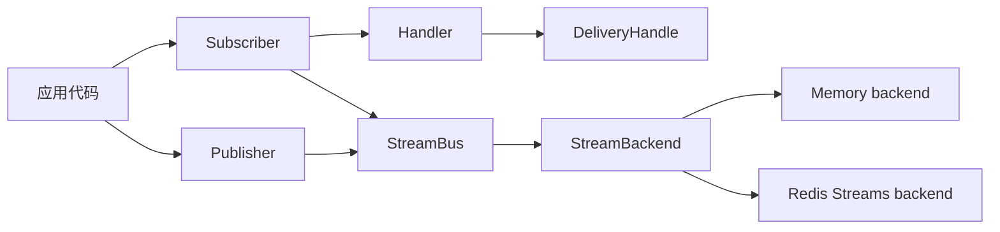

`eventbus-core` 把面向应用的发布、订阅与处理接口设计为对象安全 trait。应用既可以依赖
`Arc<dyn Publisher>` / `Arc<dyn Subscriber>` 等抽象，也可以直接使用具体的 `StreamBus<B>`。

## 应用所依赖的接口

- `Publisher::publish(message, options)` 发布一条 `Message`，返回后端分配的 `MessageId`。
- `Publisher::publish_batch(messages, options)` 返回逐条结果组成的 `BatchOutcome`，以便检查部分成功。
- `Subscriber::subscribe(config, handler)` 以 `SubscriptionConfig` 和 `Arc<dyn Handler>` 创建订阅，返回可关闭的 `Subscription`。
- `Handler::handle(delivery)` 接收 `Box<dyn DeliveryHandle>`，在异步处理结束时返回 `Result`。
- `Delivery::message()` 读取消息；`DeliveryInspector::state()` 异步读取尝试次数、最大次数和重投递状态。
- `DeliveryControl::{ack, nack, retry}` 完成投递；三个方法都消费 `Box<Self>`，因此同一 handle 在类型层面至多完成一次。

丢弃没有调用这些控制方法的 handle 也是有效路径：消息保持未确认，后端可以在 idle reclaim 后再次投递。

## 为什么使用 trait object 与 `BoxFuture`

核心 trait 的方法返回 `BoxFuture`，并把 handler、subscription 和 delivery 作为 trait object 传递。
这让库能够在运行时动态选择后端或把依赖注入为 `dyn Publisher`，同时保留 async 操作；代价是动态
分发和堆分配，而不是泛型单态化。

当不需要擦除类型时，直接持有 `StreamBus<B>` 更简洁：它实现 `Publisher + Subscriber`，并通过
`StreamBackend` 连接内存或 Redis Streams 等后端。`PublisherExt` 与 `SubscriberExt` 提供泛型便利
方法（例如直接传入具体 handler）；它们是调用端便利层，不是 trait-object 的核心接口。
