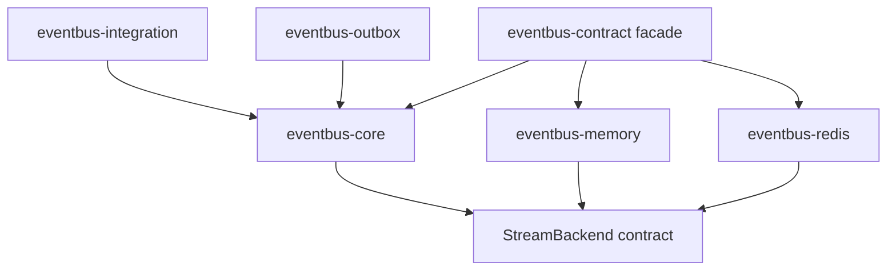

`StreamBus<B>` owns transport-independent flow：它负责发布前校验、订阅循环、并发限制、ACK batching、
retry 和 reclaim 协调。`StreamBackend` owns storage operations：它负责 group、append、read、claim 与 ACK
在具体存储中的语义。这样内存实现可用于可重复测试，Redis 实现可映射 Redis Streams，而应用面向同一
`Publisher + Subscriber` contract。

`eventbus-contract` 是应用入口；它按 feature re-export 已发布的 core、memory 与 Redis crate。
`eventbus-outbox`、`eventbus-integration` 仍是 workspace-only trait crate，计划随参考实现进入 0.3.0。
